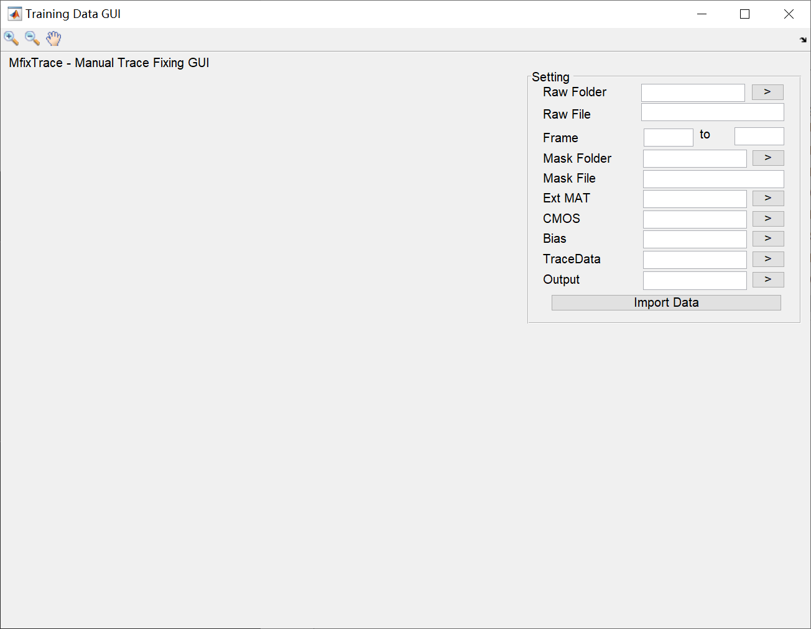
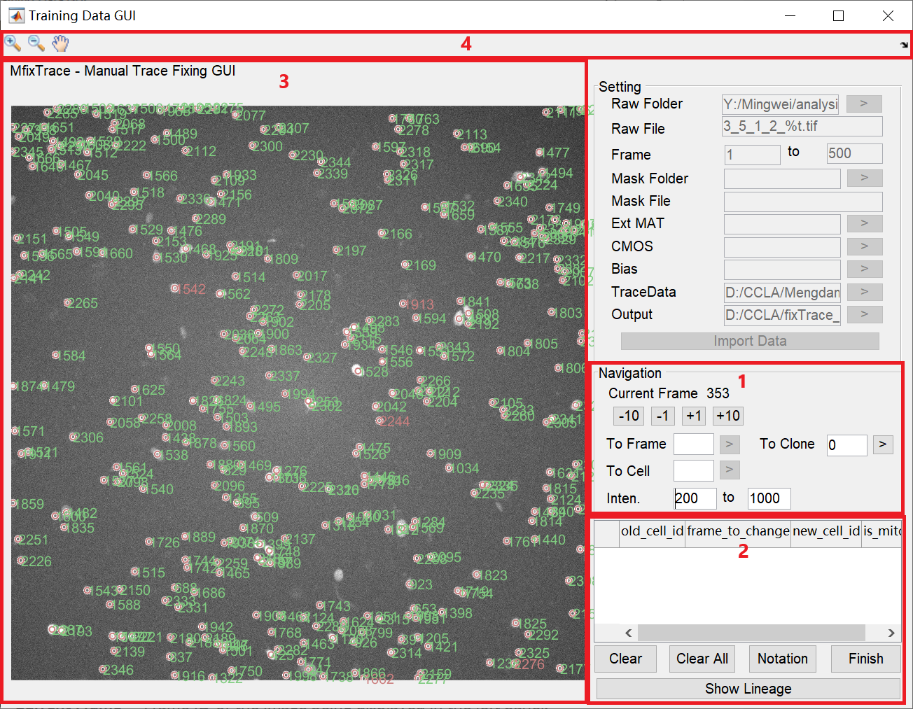

# fixTraceGUI
##### Designed by Jiasui in Min Lab

fixTraceGUI is a graphical user interface for post-tracking processing of Ming lab. It is modified from the training_data_gui of [EllipTrack](https://github.com/tianchengzhe/EllipTrack/tree/master/GUI).

### Current Features
- Allows mannually correction of the tracking dataset from TimelapseM
- Easy to use, you can generate the correction information through clicking the cell images.
- The GUI can guide the user to specifice cell/clone/frame by a simple input.
- Building temporary clone lineage base on the correction information to guide the user. 

### System Requirement
- Hardware: A modern computer
- Software: [MATLAB](https://www.mathworks.com/products/matlab.html) (Mathworks), R2020b or later.
- Required toolboxes: Image Processing Toolbox
- This GUI requires scripts in [IO_Related\Matlab](https://github.com/MingweiMin-Lab/image_processing_scripts/tree/master/IO_Related/Matlab) to function correctly.

### Installation
- Download fixTraceGUI: Click "Clone or download" on the top of the 
[image_processing_scripts](https://github.com/MingweiMin-Lab/image_processing_scripts) project page, select "Download ZIP", and extract files.
- Add the path to MATLAB, and execute:
    ```mat
    fix_trace_gui
    ```
### Documentation 
modified from the documentation of training_data_gui
#### Load Images

- Raw Folder -- Path to the folder sorting the raw images (nuclear image) of cell.
- Raw File -- Format of image filenames
    Only Frame ID ("%t") can be a variable information
    > **Example 1**. Filename follows 2_1_1_CFP_FrameID.tif. For example, 2_1_1_CFP_4.tif. Type `2_1_1_CFP_%t.tif`.
    >**Example 2**. Filename follows tFrameID.tif. Frame ID has 3 digits. For example, t001.tif. Type `t%03t.tif`. 
- Frame -- Range of frame ID
- Mask Folder -- Optional. Path to the mask images of cell. 
- Mask File -- Optional. Format of mask filenames. (Note, the GUI will switch to boundary notation automatically if this information is given)
- Ext MAT -- Optional. Path to the MAT file storing an existing correction dataset for the imported images.
- CMOS -- Optional. Path to the MAT file storing the camera dark noises. Leave empty if not available.
- Bias -- Optional. Path to the MAT file storing the illumination bias. Leave empty if not available.
- TraceData -- Path to the HDF5 file storing the tracedata generated by the tracking algorithm of timelapseM
- Output -- Path to the folder storing the output
Click "Import Data" to proceed

#### GUI Interface

1. Navigation of Frames.
    - **Current Frame** -- Frame ID of the image being displayed
    - **Switch Frames** -- Switch the image being displayed
    - **To Frame** -- Switch to any image by specifing its Frame ID in the text box and clicking ">"
    - **To Cell** -- High light any cell by specifing its cell ID in the text box and clicking ">"
    - **To Clone** -- Switch to any clone by specifing its clone ID in the text box and clicking ">". (0 for showing all cells)
    - **Intensity** -- Range of pixel intensities. Specify the lower and upper limits for display. 
    >Note: the GUI might be lagging if there is too many cells on one frame. Use Zoom in button in the tool bar to avoid this problem by visualizing a smaller area.
2. Correction Table
    - **old_cell_id** -- Cell ID of the cell to change.
    - **frame_to_change** -- Frame ID of the change you make.
    - **new_cell_id** -- New ID for selected cell.
    - **is_mitosis** -- 0 for general error, 1 for adding mitosis event, (-1 for canceling mitosis event).
    - **Clear** -- Click the target row and then hit "Clear" to remove specific row from the table.
    - **Clear all** -- Clear all data in the correction table.
    - **Notation** -- Unfinished Button, might be useful in future update.
    - **Finish** -- Click "Finish" to save the correction dataset into a file name `correctin_prefix.mat `.
    - **Show Lineage** -- Show revised lineage of the target clone. (You need to specify the clone ID in *To Clone* text box first)
    >Note: The GUI will overwrite the existed correction dataset in the output folder. If you want to keep the unmodified dataset, please move the MAT file to another folder or used another path to output your MAT file.
3. Tracking result
Image overlaid by the circle/boundary of cells and cell IDs.
    - **Green text** -- cell in migration
    - **Yellow text** -- cell in mitosis
    - **Red text** --  cell in apoptosis
    To assign an correction information, left click/double click the cell of interest to assign values in *old_cell_id*, *frame_to_change* and *is_mitosis*, and then right click another cell to fill in *new_cell_id*.

    | Behavior | old_cell_id | frame_to_change | new_cell_id | is_mitosis |
    | ------ | ------ | ------ | ------ | ------ |
    | Left click | Cell ID of left clicked cell | Frame ID of left clicked frame | 0 | 0 |
    | Left click + Right click | Cell ID of left clicked cell | Frame ID of left clicked frame | Cell ID of right clicked cell | 0 |
    | Double click + Right click | Frame ID of left clicked frame | Frame ID of right clicked frame | Cell ID of right clicked cell | 1 |
    >Note: All values in the correction table can be customized by typing value in text boxes and then hit "enter" on keyboard.

4. Tool bar
    - **Zoom In** -- enlarge the image
    - **Zoom Out** -- shrink the image
    - **Pan** -- Pan your image
    >Note: All buttons in the tool bar has two modes, activated or disactivated. Under activated mode clicking the image will only Zoom in/Zoom out/Pan the image. You need to disactivated the button (clicking the button again) in order to assign values to the correction table.